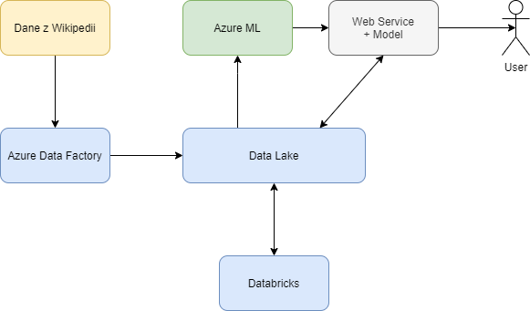

# Projekt: EY Document semantic search

**Versja:** 1.0

**Autorzy:** Mateusz Kalata, Jan Przychodniak, Natalia Strawa, Jan Konarski, Jan Łukomski

**Data utworzenia:** 26.11.2020

**Data ostatniej modyfikacji:** 26.11.2020

---

## 1.   Wymagania

### 1.1.    Funkcjonalne
*   Aplikacja ma udostępniać prosty interfejs graficzny pozwalający podać szukaną frazę oraz stronę do prezentacji wyników wyszukiwania.
*   Aplikacja ma znajdować i zwracać podobne znaczeniowo fragmenty tekstu oraz udostępniać ich źródło.
*   Aplikacja ma pracować na danych dostarczonych z korpusu polskiej Wikipedii.
### 1.2.    Niefunkcjonalne
*   Aplikacja ma bazować na algorytmach uczenia maszynowego.
### 1.3.    Przypadki użycia
*   Wyszukanie pasujących fraz.:
    *   Użytkownik podaje szukaną frazę, a następnie klika przycisk „wyszukaj”.
    *   System przeszukuje zakres dokumentów pod kątem znaczeniowo podobnych fragmentów
    *   System przygotowuje wyniki końcowe (zestaw najlepiej dopasowanych fragmentów i ich źródeł) i je wyświetla
    *   Użytkownik wybiera interesujący go fragment i przechodzi do źródła
### 1.4.    Stos technologiczny
*  Azure Machine Learning Studio
*  Python
*  Biblioteki oferujące modele do tworzenia reprezentacji wektorowej tekstu, np. gensim, tensorflow-hub, sentence-transformers, fastText, transformers
*  Biblioteka do preprocessingu tekstu, np. spacy
    
---

## 2.   Architektura
*  Pobranie danych z Wikipedii i dokonanie pre-procesingu z wykorzystaniem Databricks.
*  Obliczanie wektorów tesktu przy wykorzystaniu wytrenowanego modelu.
*  Obliczanie odległości wektorów zapytania od wektorów dokumentów.
*  Zwracamy wykinki z namniejszą odległością wektorową.

    
---

## 3.   Scrum
### 3.1 Kamienie milowe
*   Projekt modelu wyszukiwania i klasyfikacji - 10.12.2020
*   Wytrenowanie modelu i jego przetestowanie - 23.12.2020
*   Implementacja przetwarzania dokumentów z Wikipedii - 14.01.2021
*   Integracja elementów systemu i dodanie prostego interfejsu użytkownika - 27.01.2021
### 3.2.    Zadania
*   Ustawienie architektury Azure do nauki i obsługi modelu
*   Stworzenie skryptów pre-processing'u
*   Stworzenie modelu AI
*   Zebranie danych testowych
*   Nauczenie modelu
*   Ustawienie architektury Azure do przetwarzania dokumentów z Wikipedii
*   Stworzenie algorytmów przetwarzania dokumentów
*   Postawienie App Service z interfejsem użytkownika
*   Integracja komponentów 

